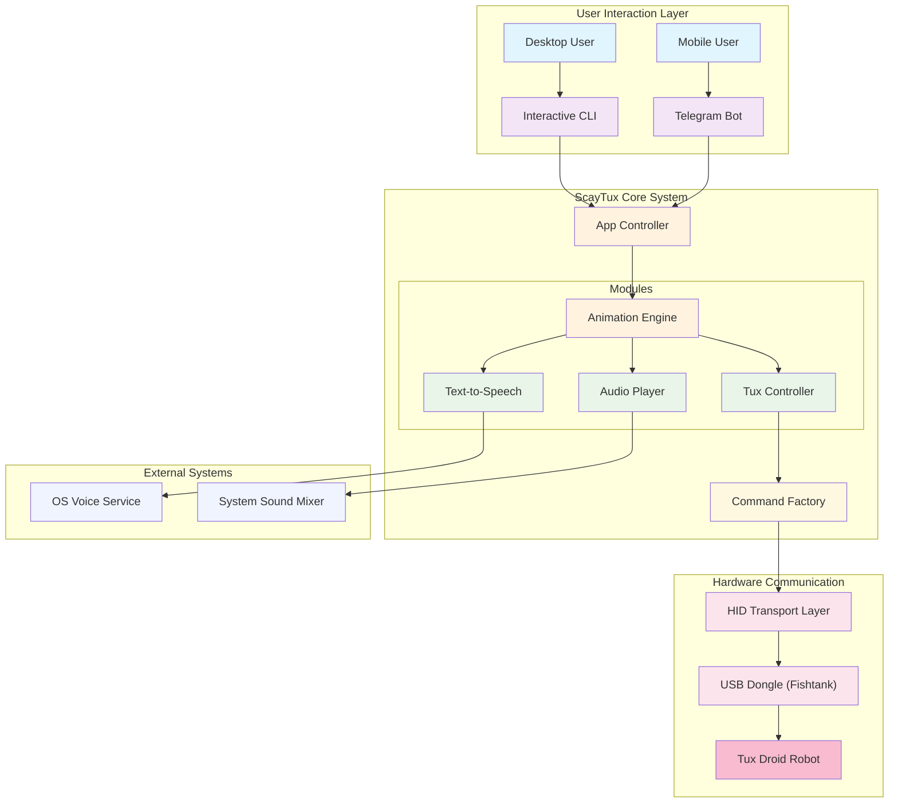
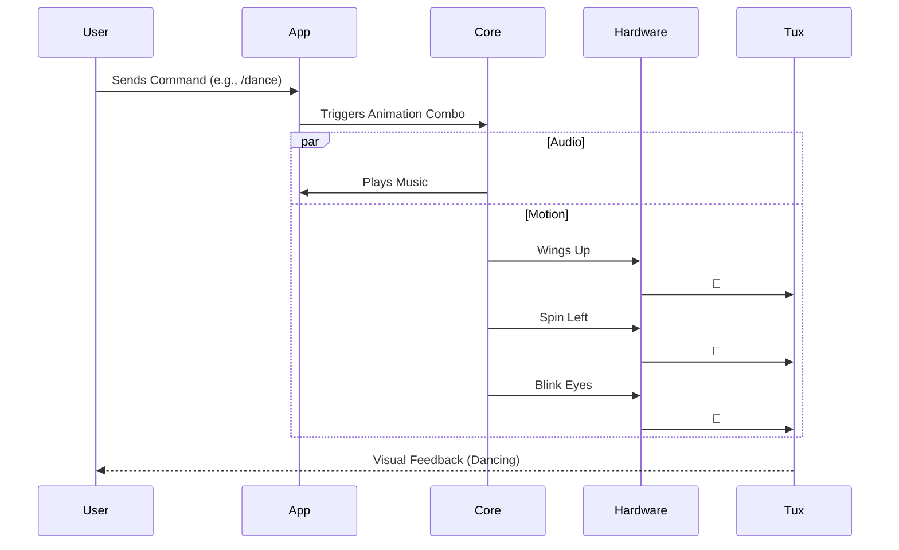

<p align="center">
  
  
  
  
</p>

<h1 align="center">🐧 ScayTux</h1>
<h3 align="center">The Ultimate Tux Droid Controller</h3>

<p align="center">
  <strong>Bring your Tux Droid back to life on modern Windows 10/11 & Linux systems!</strong>
</p>

<p align="center">
  <a href="https://github.com/Scayar"></a>
  <a href="https://github.com/Scayar/ScayTux"></a>
  <a href="https://buymeacoffee.com/scayar"></a>
</p>

---

## 📋 Table of Contents

- [Overview](#-overview)
- [Features](#-features)
- [Architecture](#-architecture)
- [Quick Start](#-quick-start)
- [Installation](#-installation)
- [Usage](#-usage)
- [Commands Reference](#-commands-reference)
- [Telegram Remote Control](#-telegram-remote-control)
- [Project Structure](#-project-structure)
- [Dependencies](#-dependencies)
- [Troubleshooting](#-troubleshooting)
- [Contributing](#-contributing)
- [Author](#-author)
- [License](#-license)

---

## 🌟 Overview

**ScayTux** is a modern, cross-platform Java application that resurrects the classic Tux Droid robot for modern operating systems. No more outdated Python scripts or broken dependencies – just pure, fast Java power with a beautiful interactive CLI, Telegram bot integration, and 55+ cinematic animation combos!

```
  ███████╗ ██████╗ █████╗ ██╗   ██╗████████╗██╗   ██╗██╗  ██╗
  ██╔════╝██╔════╝██╔══██╗╚██╗ ██╔╝╚══██╔══╝██║   ██║╚██╗██╔╝
  ███████╗██║     ███████║ ╚████╔╝    ██║   ██║   ██║ ╚███╔╝ 
  ╚════██║██║     ██╔══██║  ╚██╔╝     ██║   ██║   ██║ ██╔██╗ 
  ███████║╚██████╗██║  ██║   ██║      ██║   ╚██████╔╝██╔╝ ██╗
  ╚══════╝ ╚═════╝╚═╝  ╚═╝   ╚═╝      ╚═╝    ╚═════╝ ╚═╝  ╚═╝
```

---

## ✨ Features

| Feature | Description |
|---------|-------------|
| ⚡ **Cross-Platform** | Single codebase for Windows 10/11 and Linux (Ubuntu/Debian) |
| 📱 **Telegram Remote** | Control your Tux from anywhere via Telegram Bot |
| 🗣️ **Text-to-Speech** | Windows: Native PowerShell • Linux: espeak |
| 🎵 **Music Player** | Play MP3s through Tux Droid with synchronized dancing |
| 🎭 **55 Cinematic Combos** | Pre-programmed animations from "Royal Entrance" to "DJ Mode" |
| 🔌 **Plug & Play** | Auto-detects USB dongle (VID: 0x03eb, PID: 0xFF07) |
| ⌨️ **Interactive CLI** | Beautiful menu-driven interface with ANSI colors |
| 🦅 **Full Motor Control** | Eyes, Mouth, Wings, Spin, LED with smooth animations |

---

## 🏗️ Architecture



### Data Flow Overview



---

## 🚀 Quick Start

### 🪟 Windows (One-Click)

```bash
# 1. Clone the repository
git clone https://github.com/Scayar/ScayTux

# 2. Double-click to run
START_WINDOWS.bat
```

> **Automatic**: Installs portable Maven, builds project, launches Interactive Mode

### 🐧 Linux (One-Command)

```bash
git clone https://github.com/Scayar/ScayTux
cd ScayTux
chmod +x START_LINUX.sh && ./START_LINUX.sh
```

> **Automatic**: Installs OpenJDK, Maven, espeak, libhidapi, sets udev rules

---

## 📦 Installation

### Prerequisites

| Platform | Requirement | Installation |
|----------|-------------|--------------|
| **All** | Java 8+ | [Adoptium](https://adoptium.net/) or [Oracle](https://www.oracle.com/java/technologies/downloads/) |
| **All** | Maven 3.6+ | Auto-installed by launcher scripts |
| **Linux** | libhidapi | `sudo apt install libhidapi-hidraw0 libhidapi-dev` |
| **Linux** | espeak (TTS) | `sudo apt install espeak` |

### Linux USB Permissions

The launcher script auto-configures this, but for manual setup:

```bash
# Create udev rule for Tux Droid dongle
sudo bash -c 'cat > /etc/udev/rules.d/99-tuxdroid.rules << EOF
SUBSYSTEM=="usb", ATTR{idVendor}=="03eb", ATTR{idProduct}=="ff07", MODE="0666", GROUP="plugdev"
KERNEL=="hidraw*", ATTR{idVendor}=="03eb", ATTR{idProduct}=="ff07", MODE="0666", GROUP="plugdev"
EOF'

# Reload rules
sudo udevadm control --reload-rules
sudo udevadm trigger

# Add user to plugdev group
sudo usermod -aG plugdev $USER

# Log out and back in
```

---

## 🎮 Usage

### Interactive Mode (Default)

```bash
java -jar target/ScayTux.jar
```

```
[ MAIN MENU ]
1. Interactive Menu (Select combos by number)
2. Manual / REPL Mode (Type commands freely)
3. 📱 Telegram Control (Control via Telegram Bot)
4. Exit
```

### Command-Line Mode

```bash
# Basic controls
java -jar target/ScayTux.jar --flap
java -jar target/ScayTux.jar --eyes true
java -jar target/ScayTux.jar --blink 5
java -jar target/ScayTux.jar --spin left --val 100

# Text-to-Speech
java -jar target/ScayTux.jar --say "Hello World"

# Play music with dance
java -jar target/ScayTux.jar --play assets/audio/billie.mp3

# Run cinematic combo
java -jar target/ScayTux.jar --combo 6

# Debug mode
java -jar target/ScayTux.jar --debug
```

---

## 📚 Commands Reference

### CLI Arguments

| Flag | Description | Example |
|------|-------------|---------|
| `-i, --interactive` | Force interactive mode | `-i` |
| `--flap` | Flap wings up and down | `--flap` |
| `--eyes <bool>` | Open (true) or close (false) eyes | `--eyes true` |
| `--blink <n>` | Blink eyes N times | `--blink 5` |
| `--mouth <bool>` | Open (true) or close (false) mouth | `--mouth true` |
| `--talk <n>` | Move mouth N times | `--talk 10` |
| `--spin <dir>` | Spin left or right | `--spin left` |
| `--val <n>` | Duration/loops for spin | `--val 100` |
| `--led <color>` | LED color (1=Red, 2=Blue, 3=Yellow) | `--led 2` |
| `--intensity <n>` | LED intensity (0-255) | `--intensity 255` |
| `--say <text>` | Speak text with TTS | `--say "Hello"` |
| `--combo <id>` | Run combo (1-55) | `--combo 6` |
| `--play <file>` | Play MP3 file | `--play song.mp3` |
| `-l, --list` | Check device connection | `-l` |
| `-d, --debug` | Debug HID input monitor | `-d` |

### Top 10 Cinematic Combos

| ID | Name | Description |
|----|------|-------------|
| 1 | Royal Entrance | "I have arrived." Slow eye open, blue light fade-in |
| 2 | Bird Flex | Rapid wing flapping show-off |
| 3 | Brain Loading | Thinking animation with red light pulsing |
| 4 | Sleep Mode | Yawn, eyes close, lights out |
| 5 | Hacker Alert | Emergency red strobe and panic spin |
| 6 | Police Mode | Red/Blue siren + 360° spin × 3 |
| 7 | Shy Bird | Whispers and hides eyes |
| 8 | Laugh Mode | "Ha ha ha!" with happy movements |
| 9 | Kiss 😘 | Smack sound + wink |
| 10 | Bird Crying | Sad voice + dim blue light |

> **Full list**: Run interactive mode and select "Show All 50 Combos"

### Music Dancing Modes

| ID | Mode | Song |
|----|------|------|
| 51 | Michael Jackson | Billie Jean (2 min) |
| 52 | Chicken Dance | Chicken Song (2 min) |
| 53 | Suirian Dabkah | Traditional Dance (2 min) |
| 54 | Crazy Mode | Crazy Song (2 min) |
| 55 | Say My Name | Say My Name (2 min) |

---

## 📱 Telegram Remote Control

Control your Tux Droid from anywhere with Telegram!

### Setup

1. **Create Bot**: Message [@BotFather](https://t.me/BotFather) → `/newbot` → Copy token
2. **Get Chat ID**: Message [@userinfobot](https://t.me/userinfobot) → `/start` → Copy ID
3. **Configure**: Run ScayTux → `📱 Telegram Control` → `📝 Configure Bot`
4. **Start**: Select `▶️ Start Bot`

### Bot Commands

| Command | Description |
|---------|-------------|
| `/start` | Show main menu with buttons |
| `/connect` | Connect to Tux Droid |
| `/flap` | Flap wings |
| `/blink` | Blink eyes |
| `/spin_left` | Spin left |
| `/spin_right` | Spin right |
| `/dance` | Dance animation |
| `/say <text>` | Make Tux speak |
| `/combo_<n>` | Run combo (1-55) |
| `/stop` | Stop music |

---

## 📁 Project Structure

```
ScayTux/
├── 📄 START_WINDOWS.bat          # Windows one-click launcher
├── 📄 START_LINUX.sh             # Linux one-click launcher
├── 📄 pom.xml                    # Maven build configuration
├── 📄 telegram_config.json       # Telegram bot configuration
│
├── 📂 src/main/java/com/kowalski7cc/jtuxdriver/
│   ├── 📂 cli/
│   │   ├── Main.java             # Entry point & CLI parser
│   │   ├── InteractiveMode.java  # Interactive menu system
│   │   └── Debug.java            # Debug utilities
│   │
│   ├── 📂 core/
│   │   ├── HidTransport.java     # USB HID communication (hid4java)
│   │   └── UsbTransport.java     # Transport interface
│   │
│   ├── 📂 telegram/
│   │   ├── TelegramController.java # Bot command handler
│   │   └── TelegramManager.java    # Bot lifecycle manager
│   │
│   ├── TuxDroid.java             # High-level Tux control API
│   ├── TuxCombos.java            # 55 cinematic animations
│   ├── Command.java              # USB packet factory
│   ├── AudioPlayer.java          # Cross-platform MP3 player
│   ├── TTS.java                  # Text-to-Speech engine
│   ├── TuxInput.java             # Button input handler
│   └── USBDefines.java           # USB constants
│
├── 📂 assets/audio/              # MP3 files for dancing
│   ├── billie.mp3
│   ├── chicken.mp3
│   ├── crazy.mp3
│   ├── Say My Name.mp3
│   └── Suirian dabkah.mp3
│
├── 📂 docs/
│   ├── COMMAND_REFERENCE.md      # Full command documentation
│   └── LICENSE                   # LGPL-3.0 License
│
└── 📂 target/
    └── ScayTux.jar               # Compiled fat JAR
```

---

## 📦 Dependencies

| Library | Version | Purpose |
|---------|---------|---------|
| [hid4java](https://github.com/gary-rowe/hid4java) | 0.8.0 | USB HID communication |
| [Picocli](https://picocli.info/) | 4.7.5 | CLI argument parsing |
| [JLayer](http://www.javazoom.net/javalayer/javalayer.html) | 1.0.1 | MP3 decoding |
| [TelegramBots](https://github.com/rubenlagus/TelegramBots) | 6.8.0 | Telegram Bot API |
| [Gson](https://github.com/google/gson) | 2.10.1 | JSON configuration |
| [JUnit 5](https://junit.org/junit5/) | 5.10.0 | Unit testing |

---

## 🔧 Troubleshooting

### Windows

| Issue | Solution |
|-------|----------|
| "Java is not installed" | Download from [Adoptium](https://adoptium.net/) |
| "Build failed" | Delete `target/` folder and retry |
| "Device not found" | Try different USB port |
| No audio from Tux | Check Windows sound mixer for "TuxDroid-Audio" |

### Linux

| Issue | Solution |
|-------|----------|
| "Permission denied" for USB | Run launcher script (auto-configures udev rules) |
| "espeak not found" | `sudo apt install espeak` |
| "libhidapi not found" | `sudo apt install libhidapi-hidraw0 libhidapi-dev` |
| Need to logout | Group membership requires re-login |

### Common

| Issue | Solution |
|-------|----------|
| Tux not responding | 1. Unplug dongle 2. Wait 5s 3. Replug |
| Spin stutters | Increase `--val` value (try 100+) |
| TTS sounds robotic | Expected on Linux (espeak), Windows uses native |

---

## 🤝 Contributing

Contributions are welcome! Feel free to:

1. **Fork** the repository
2. **Create** a feature branch (`git checkout -b feature/amazing-feature`)
3. **Commit** changes (`git commit -m 'Add amazing feature'`)
4. **Push** to branch (`git push origin feature/amazing-feature`)
5. **Open** a Pull Request

---

## 👨‍💻 Author

<p align="center">
  <a href="https://github.com/Scayar">
    
  </a>
</p>

| | |
|---|---|
| **Name** | Scayar |
| **GitHub** | [github.com/Scayar](https://github.com/Scayar) |
| **Email** | Scayar.exe@gmail.com |
| **Website** | [Scayar.com](https://Scayar.com) |
| **Telegram** | [@im_scayar](https://t.me/im_scayar) |
| **Support** | [Buy Me a Coffee ☕](https://buymeacoffee.com/scayar) |

---

## ❤️ Support

If you like this project, please:

- ⭐ **Star** this repository
- 🍕 [**Buy me a coffee**](https://buymeacoffee.com/scayar)
- 📢 **Share** with other Tux Droid owners
- 🐛 **Report bugs** via GitHub Issues

---

## 📄 License

This project is licensed under the **GNU Lesser General Public License v3.0** - see the [LICENSE](docs/LICENSE) file for details.

---

<p align="center">
  <strong>Made with ♥ by Scayar</strong><br>
  <em>"Tux Droid Never Dies!"</em> 🐧💙
</p>

<p align="center">
  
</p>
